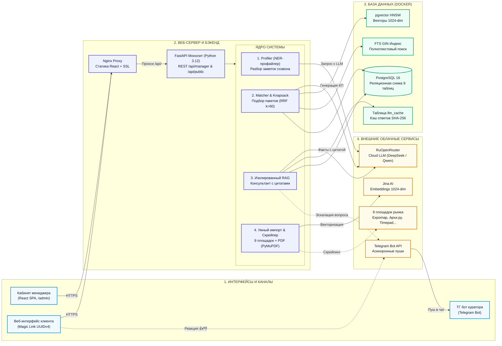

# Схема архитектуры системы Digital Assistant (Светлая тема, 16:9)

```mermaid
flowchart LR
    %% Стили светлой темы с высоким контрастом (для слайдов и презентаций)
    classDef client fill:#F0F9FF,stroke:#0284C7,stroke-width:2px,color:#0F172A;
    classDef server fill:#EEF2FF,stroke:#4F46E5,stroke-width:2px,color:#0F172A;
    classDef storage fill:#ECFDF5,stroke:#059669,stroke-width:2px,color:#0F172A;
    classDef cloud fill:#FFFBEB,stroke:#D97706,stroke-width:2px,color:#0F172A;

    %% 1. Интерфейсы
    subgraph UI ["1. ИНТЕРФЕЙСЫ И КАНАЛЫ"]
        direction TB
        M["Кабинет менеджера<br>(React SPA, /admin)"]:::client
        C["Веб-интерфейс клиента<br>(Magic Link UUIDv4)"]:::client
        TG["ТГ бот куратора<br>(Telegram Bot)"]:::client
    end

    %% 2. Сервер приложений
    subgraph APP ["2. ВЕБ-СЕРВЕР И БЭКЕНД"]
        direction TB
        NGX["Nginx Proxy<br>Статика React + SSL"]:::server
        API["FastAPI Монолит (Python 3.12)<br>REST /api/manager & /api/public"]:::server
        
        subgraph CORE ["ЯДРО СИСТЕМЫ"]
            direction TB
            P["1. Profiler (NER-профайлер)<br>Разбор заметок созвона"]:::server
            K["2. Matcher & Knapsack<br>Подбор пакетов (RRF k=60)"]:::server
            R["3. Изолированный RAG<br>Консультант с цитатами"]:::server
            I["4. Умный импорт & Скрейпер<br>9 площадок + PDF (PyMuPDF)"]:::server
        end
    end

    %% 3. База данных
    subgraph DATA ["3. БАЗА ДАННЫХ (DOCKER)"]
        direction TB
        DB[("PostgreSQL 16<br>Реляционная схема 9 таблиц")]:::storage
        HNSW["pgvector HNSW<br>Векторы 1024-dim"]:::storage
        GIN["FTS GIN Индекс<br>Полнотекстовый поиск"]:::storage
        CACHE["Таблица llm_cache<br>Кэш ответов SHA-256"]:::storage
    end

    %% 4. Внешние сервисы
    subgraph CLOUD ["4. ВНЕШНИЕ ОБЛАЧНЫЕ СЕРВИСЫ"]
        direction TB
        LLM["RuOpenRouter<br>Cloud LLM (DeepSeek / Qwen)"]:::cloud
        EMB["Jina AI<br>Embeddings 1024-dim"]:::cloud
        TGBOT["Telegram Bot API<br>Асинхронные пуши"]:::cloud
        WEB["9 площадок рынка<br>Expomap, Архи.ру, Timepad..."]:::cloud
    end

    %% Взаимодействия
    M -->|HTTPS| NGX
    C -->|HTTPS| NGX
    NGX -->|Прокси /api/| API
    
    API --> CORE

    P -->|Запрос к LLM| LLM
    K -->|Генерация КП| LLM
    R -->|Факты с цитатой| LLM
    I -->|Векторизация| EMB
    I -.->|Скрейпинг| WEB

    K --> HNSW
    K --> GIN
    K --> DB
    R --> CACHE
    R --> DB

    R -.->|Эскалация вопроса| TGBOT
    C -.->|Реакция 👍/👎| TGBOT
    TGBOT -->|Пуш в чат| TG
```
